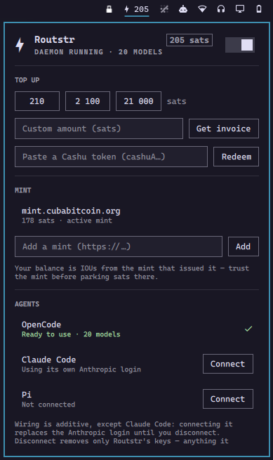

# Omarchy Routstr

An [Omarchy](https://omarchy.org) plugin for buying [Routstr](https://routstr.com) AI inference privately.

Routstr is pay-per-request inference with Bitcoin. You pay with Lightning or Cashu, there is no account to create, and there is no KYC or API-key dashboard. This plugin is the bar and panel for that on Omarchy: you fund a local [`routstrd`](https://github.com/Routstr/routstrd), see what is left, and top up when it runs low.

This project is not affiliated with Routstr. It drives their daemon. Tested against routstrd 0.3.11.



## What it does

`routstrd` holds the wallet and pays providers. This plugin never opens that wallet. It talks to the daemon on `127.0.0.1:8008` and gives you a UI for the parts you would otherwise do in a terminal:

- Balance and daemon status in the bar (left click opens the panel, middle click refreshes)
- Lightning invoices from preset amounts or a custom number of sats, shown as a QR
- Redeem a Cashu token (`cashuA…` / `cashuB…`). That is the more private way to top up; a Lightning invoice can leak payment metadata
- Which mint holds the balance, add another mint, and (if you have more than one) where new Lightning invoices land
- Turn individual Routstr providers on or off
- Copy a `routstr/<model-id>` if you are editing a client config yourself
- Last request cost
- A prepaid Routstr row in Omarchy’s built-in agents panel (balance and spend)

The wallet mnemonic is created by `routstrd onboard` in a normal terminal, because that command prints the seed. The plugin never reads, stores, or prints it, and it cannot recover it for you.

There is no chat UI. Inference stays in `routstrd`. The plugin does not proxy requests through `omarchy-shell`.

“No account” is true. “Anonymous” is not, on its own: Cashu balance is an IOU from the mint, Lightning invoices have metadata, and the inference provider still sees the prompt. The panel footer says the same thing.

## Optional: OpenCode and other clients

The daemon serves an OpenAI-compatible API on `http://127.0.0.1:8008`. If you use OpenCode, Claude Code, Pi, or OpenClaw, the panel can point them at that endpoint so they spend the same balance.

This is optional. The main job of the plugin is funding Routstr, not running an agent.

- OpenCode, Pi, and OpenClaw get a Routstr provider added next to whatever they already have
- Claude Code is a takeover: it replaces your Anthropic login until you disconnect. The panel asks first
- Nothing under `~/.config` is written until you press Connect
- `autoWireOpencode` will connect OpenCode without the click. It is off by default

Connect runs `routstrd clients add` with the matching flag (`--opencode`, `--claude-code`, `--pi-agent`, `--openclaw`). Disconnect deletes the daemon-side client, then removes only Routstr’s keys from the file.

## Install

```sh
omarchy plugin add https://github.com/babdbtc/omarchy-routstr.git --enable
```

You need Omarchy Quattro, [Bun](https://bun.sh), and `routstrd`.

`omarchy plugin add` only clones the repo, and it cannot run install hooks. No sudo or pkexec is required. The panel prints the commands to install Bun, install `routstrd`, create the wallet, and start the daemon, and you run those yourself.

It also calls `curl`, `jq`, `qrencode`, `wl-copy`, `notify-send`, and `omarchy-launch-terminal`. Those are Omarchy base packages. If a tool the plugin needs a result from is missing, the panel names it. Copy, notifications, and opening a terminal fail silently if those helpers are gone.

## Settings

| Setting | Default | Meaning |
| --- | --- | --- |
| Refresh interval | 30s | How often the bar polls the daemon |
| Low-balance warning | 100 sats | Bar goes urgent at or below this |
| Hide sats in the bar | off | Show the glyph and state only (sats still appear in the panel) |
| Connect OpenCode automatically | off | Edit `opencode.json` without asking |
| Default top-up | 2100 sats | Amount used by the IPC `topup` command when you do not pass one |

## Files it writes

| Path | When | What |
| --- | --- | --- |
| `~/.config/opencode/opencode.json` | Connect OpenCode | `routstrd` merges `provider.routstr`. A `model` or `small_model` you already set is left alone. |
| `~/.claude/settings.json` | Connect Claude Code | `ANTHROPIC_BASE_URL` and `ANTHROPIC_AUTH_TOKEN`. These replace your Anthropic login until you disconnect. |
| `~/.pi/agent/models.json` | Connect Pi | Adds `providers.routstr`. |
| `~/.openclaw/openclaw.json` | Connect OpenClaw | Adds `providers.routstr`. |
| `<file>.bak-routstr-<timestamp>` | Once, before the first write to each file above | Copy of the original. |
| `~/.local/state/omarchy/agents/usage/routstr.json` | While the daemon is answering | Balance and spend, for the built-in agents panel. |
| `$XDG_RUNTIME_DIR/omarchy-routstr*` | Top-up and similar | Invoice QR and lock files. Gone on reboot. |

The wallet is not in this list. It lives in `routstrd` (`~/.routstrd/wallet/`).

## Uninstall

If you connected any clients, disconnect them in the panel first. After the plugin is removed, there is no UI left that will clean those configs.

```sh
omarchy plugin remove io.github.babdbtc.routstr
rm -f "${XDG_STATE_HOME:-$HOME/.local/state}/omarchy/agents/usage/routstr.json"
```

The `rm` drops the prepaid row in the agents panel.

Disconnect removes Routstr’s keys. It does not put your previous values back. If you had handwritten `ANTHROPIC_*` entries before connecting, they are in the `.bak-routstr-*` file next to the live one, and Claude Code goes back to its own login.

If you remove the plugin first, do the cleanup by hand:

```sh
routstrd clients list
routstrd clients delete <id>
```

Then take `provider.routstr` out of `opencode.json` (and the matching keys out of the other configs). If you leave them, those programs keep calling `127.0.0.1:8008` after the daemon is gone.

The daemon and the wallet stay installed. Uninstalling them is `routstrd`’s job. Sweep the balance first if you are done — it is real money, and this plugin never had the mnemonic.

## IPC

Plugin id `io.github.babdbtc.routstr`, IPC target `routstr`:

```sh
omarchy-shell routstr toggle      # open or close the panel
omarchy-shell routstr status      # one-line state
omarchy-shell routstr topup 2100  # Lightning invoice and QR in the panel
omarchy-shell routstr wire        # routstrd clients add --opencode
```

## Tests

```sh
node --test "test/*.test.mjs"
```

`Model.js` is a QML `.pragma library` of plain functions. It also holds the text of every shell script the plugin runs. The suite strips that one QML line and executes those same scripts against fixture client configs and a stub daemon.

## Docs

- [docs/DESIGN.md](docs/DESIGN.md) — product, architecture, scope
- [manifest.json](manifest.json) — Omarchy plugin contract
- [test/](test/) — fixtures and tests

## License

MIT. See [LICENSE](LICENSE).
